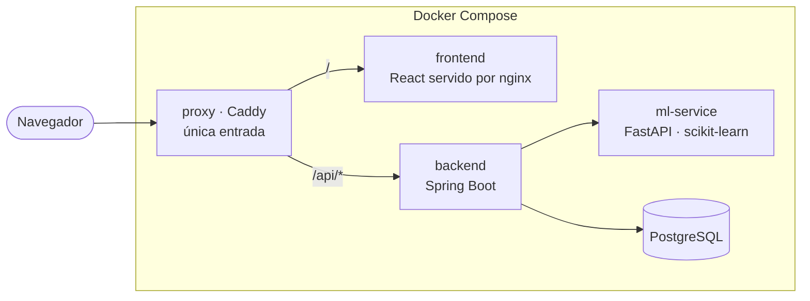

<div align="center">

# ⚡ EnergIA

### Analizador inteligente de eficiencia energética

**[energia.neo236.fun](https://energia.neo236.fun)** · uso libre, sin registro


</div>

---

## Qué hace

Millones de hogares y pequeños comercios reciben facturas de luz elevadas **sin
entender qué hábitos las generan**. EnergIA convierte datos crudos de consumo en
información accionable: recibe el consumo mensual, la cantidad de equipos, el
tipo de inmueble y algunos datos opcionales sobre la vivienda, y devuelve

- 🔍 una **clasificación del perfil energético** mediante *machine learning*
  (`Eficiente`, `Moderado`, `Ineficiente`) con su probabilidad,
- 💰 el **costo mensual estimado** según una tarifa de referencia, y
- 💡 **recomendaciones concretas** para reducir el consumo.

Todo por una API REST, y por una interfaz web que no pide registrarse.

---

## Origen del proyecto

EnergIA nació como **EnergiAI** en el **Hackathon ONE** (Alura + Oracle, grupo
G9 LATAM), construido por un equipo de ocho personas durante tres sprints. Este
repositorio conserva **el historial completo de commits y la autoría de todo el
equipo**.

La versión entregada y evaluada en el hackathon está marcada con el tag
[**`v1.0-hackathon`**](https://github.com/Neo236/EnergIA/releases/tag/v1.0-hackathon),
y el repositorio original sigue disponible en
[No-Country-simulation/G9-LATAM-TEAM-09](https://github.com/No-Country-simulation/G9-LATAM-TEAM-09).

A partir de ese punto el proyecto continúa como EnergIA, y el despliegue dejó
de depender de Oracle Cloud: el stack corre entero en Docker Compose y no asume
nada sobre dónde está alojado.

---

## Stack

| Capa | Tecnología | Rol |
|------|-----------|-----|
| **Front-End** | Vite · React 19 · TypeScript | Interfaz de carga de datos y presentación del resultado. Compila a estáticos, servidos por nginx. |
| **Back-End** | Java 17 · Spring Boot 4.1.1 | API REST, validaciones, orquestación y persistencia. |
| **Data Science** | Python 3.10 · pandas · scikit-learn | Análisis exploratorio, entrenamiento del modelo y servicio de inferencia (FastAPI). |
| **Datos** | PostgreSQL 16 | Persistencia de los análisis. |
| **Infraestructura** | Docker Compose · Caddy | Cuatro servicios y un proxy que los unifica bajo un solo puerto. |

---

## Arquitectura



**El stack publica un solo puerto.** El servicio `proxy` sirve la aplicación en
la raíz y enruta `/api/*` al back-end, así que la interfaz y la API comparten
origen y **la aplicación no necesita CORS**. El resto de los servicios no
publican puertos: solo se alcanzan por la red interna de Compose.

Eso también lo vuelve portable: el stack funciona igual solo, detrás de un
proxy inverso o en un orquestador, porque no asume nada sobre lo que tiene
delante.

> Las decisiones que no son obvias —por qué el modelo se versiona en el repo,
> por qué no hay endpoint de borrado, qué pasa con la tipografía— están
> explicadas en [`docs/architecture/`](./docs/architecture/README.md).

---

## Documentación

| Área | Contenido |
|------|-----------|
| [🏛️ Arquitectura](./docs/architecture/README.md) | Cómo se conectan las piezas y por qué |
| [🚀 Despliegue](./docs/DESPLIEGUE.md) | Ejecución local y actualización en producción |
| [☕ Back-End](./docs/backend/README.md) | Contrato de la API, Swagger, Postman |
| [🐍 Data Science](./docs/data-science/README.md) | EDA, modelo y métricas |
| [🖥️ Front-End](./docs/frontend/README.md) | Sistema de diseño y accesibilidad |

---

## Ejecución local

**Requisitos:** Docker y Docker Compose. Nada más — Java, Node y Python corren
dentro de los contenedores.

```bash
git clone https://github.com/Neo236/EnergIA.git
cd EnergIA
docker compose up --build -d
```

La aplicación queda en **http://localhost:8088**. Detalle de los modos de
ejecución, incluido el desarrollo servicio por servicio, en
[`docs/DESPLIEGUE.md`](./docs/DESPLIEGUE.md).

---

## La API

### Endpoint principal

```
POST /api/v1/analisis-energetico
Content-Type: application/json
```

```json
{
  "consumo_kwh": 420,
  "cantidad_equipos": 10,
  "tipo_inmueble": "Casa",
  "uso_horario_pico": false,
  "horas_alto_consumo": 12,
  "zona_fria": false,
  "calidad_aislamiento": "Media",
  "fuente_calefaccion": "Electricidad",
  "fuente_agua_caliente": "Electricidad"
}
```

**Respuesta `200 OK`:**

```json
{
  "id": "01a055ed-cc4e-764b-b0e2-919c8084bfbd",
  "fecha": "2026-08-31T03:47:22.829",
  "categoria": "Moderado",
  "probabilidad": 0.675,
  "costo_estimado_mensual": 315.0,
  "recomendaciones": [
    "Evalúa migrar la calefacción a Solar o Gas: la electricidad es la fuente más cara del dataset."
  ]
}
```

Cada análisis se persiste y queda accesible en `GET /api/v1/analisis-energetico/{id}`,
lo que hace que la URL del resultado sea compartible y sobreviva a una recarga.

### Validaciones

| Campo | Tipo | Obligatorio | Restricciones |
|-------|------|:-----------:|---------------|
| `consumo_kwh` | `Double` | ✅ | 1 ≤ valor ≤ 1000 |
| `cantidad_equipos` | `Integer` | ✅ | 1 ≤ valor ≤ 100 |
| `tipo_inmueble` | `Enum` | ✅ | `Casa`, `Departamento`, `Comercio`, `Pyme` |
| `horas_alto_consumo` | `Integer` | ✅ | 0 ≤ valor ≤ 24 |
| `uso_horario_pico` | `Boolean` | — | `true` / `false` |
| `metros_cuadrados` | `Integer` | — | 26 ≤ valor ≤ 2000 |
| `antiguedad_vivienda` | `Integer` | — | 0 ≤ valor ≤ 150 |
| `zona_fria` | `Boolean` | — | `true` / `false` |
| `calidad_aislamiento` | `Enum` | — | `Muy Alta`, `Alta`, `Media`, `Baja`, `Muy Baja` |
| `fuente_calefaccion` | `Enum` | — | `Solar`, `Electricidad`, `Otros` |
| `fuente_agua_caliente` | `Enum` | — | `Solar`, `Electricidad`, `Otros` |

### Documentación interactiva

| Herramienta | Local | Producción |
|-------------|-------|------------|
| **Swagger UI** | `http://localhost:8088/swagger-ui/index.html` | [energia.neo236.fun/swagger-ui/index.html](https://energia.neo236.fun/swagger-ui/index.html) |
| **OpenAPI JSON** | `http://localhost:8088/v3/api-docs` | [energia.neo236.fun/v3/api-docs](https://energia.neo236.fun/v3/api-docs) |
| **Health check** | `http://localhost:8088/actuator/health` | [energia.neo236.fun/actuator/health](https://energia.neo236.fun/actuator/health) |

---

## Contribuir

`main` está protegida: los cambios entran por Pull Request con la integración
continua en verde. El flujo y las convenciones están en
[`CONTRIBUTING.md`](./CONTRIBUTING.md).

Si trabajás con un asistente de IA, [`AGENTS.md`](./AGENTS.md) contiene el
contexto del proyecto y las trampas conocidas.

---

## Equipo

Construido durante el Hackathon ONE por el grupo G9 LATAM:

| Nombre | Rol |
|--------|-----|
| **Constanza Albornoz** | Data Analyst |
| **Alan Federico Cabrera** | Backend Developer |
| **Lautaro Sebastián Mambrin** | Full Stack Developer |
| **Leandro Ariel Moreno** | Backend Developer |
| **Randy Roco Mellado** | Data Engineer |
| **Nahuel Rosas** | Data Scientist |
| **Marco Antonio Soto Bobadilla** | Project Manager |
| **Sergio Villena** | Software Engineer |

---

## Licencia

MIT. Ver [`LICENSE`](./LICENSE).

La tipografía Inter, incluida en `frontend/public/fonts/`, se distribuye bajo la
SIL Open Font License 1.1.
