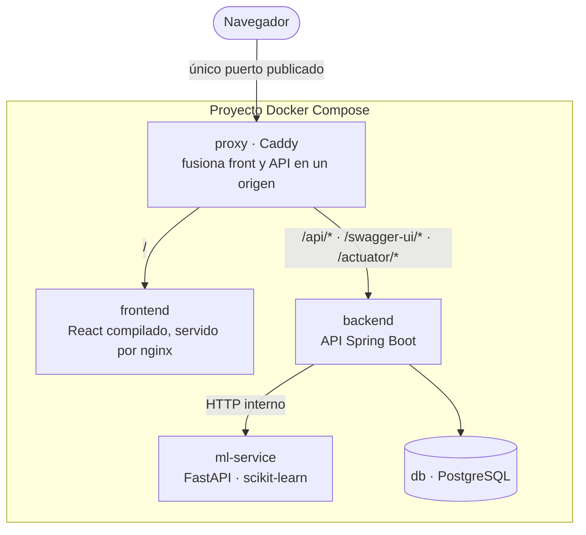

# 🏛️ Arquitectura

## El sistema en una imagen

## Cómo leerlo

**El stack publica un solo puerto.** El servicio `proxy` sirve la aplicación en
la raíz y enruta `/api/*` al back-end. Como la interfaz y la API comparten
origen, **no hace falta CORS**. Backend, ml-service y base de datos no publican
puertos: solo se alcanzan por la red interna de Compose.

**La llamada al modelo nunca sale del servidor.** Viaja contenedor a contenedor,
sin pasar por el proxy ni por internet.

**Nada asume lo que hay delante.** El stack funciona igual expuesto
directamente, detrás de un proxy inverso o en un orquestador. Esa
independencia es deliberada: la aplicación cambió de alojamiento una vez, y el
código no tuvo que enterarse.

---

## Decisiones que no son obvias

### El modelo entrenado se versiona en el repositorio

`data-science/data/latest/` contiene el `.joblib` del modelo, con una excepción
explícita al `*.joblib` del `.gitignore`.

Antes el modelo vivía únicamente en un bucket de Object Storage, y el servicio
lo descargaba al arrancar. Eso significaba que el artefacto más importante del
proyecto existía en un solo lugar, fuera del control de versiones: si el bucket
desaparecía, el modelo se perdía.

Hoy el modelo viaja con el código y `LocalStorage` lo lee desde ahí
(`STORAGE_LOCAL_ROOT=/app/data`). El despliegue no depende de ningún servicio
externo, y el modelo que corre es exactamente el que está commiteado. Son ~2 MB.

> El servicio conserva un camino de respaldo: si no encuentra el modelo, lo
> reentrena al arrancar con la misma semilla fija. Funciona, pero tarda y produce
> un modelo equivalente, no idéntico. Que el `.joblib` esté versionado es lo que
> evita ese camino.

### El bind del proxy no es `0.0.0.0`

La variable `PROXY_BIND` fija en qué interfaz escucha el único puerto publicado.
Por defecto `127.0.0.1`; en un despliegue se apunta a la interfaz concreta por
la que debe entrar el tráfico, y nunca a `0.0.0.0`.

El motivo es una trampa conocida: **Docker publica sus puertos con reglas
propias de iptables en la cadena FORWARD**, que las reglas de un firewall de
host sobre INPUT no cubren. Un bind a `0.0.0.0` queda alcanzable desde toda la
red del servidor aunque el firewall afirme lo contrario. Atarlo a una interfaz
concreta hace que el puerto exista solo ahí, sin depender de si el firewall
filtra o no el tráfico de Docker.

Importa cuando la máquina aloja algo más que este proyecto, que es lo habitual.

### La tipografía se sirve desde el propio origen

Una Content-Security-Policy razonable —`style-src 'self'`, `font-src 'self'
data:`— bloquea la hoja de estilos de Google Fonts y sus archivos de fuente. La
aplicación cae entonces a la tipografía de respaldo, perdiendo la fuente sobre
la que está construido todo el sistema de diseño.

No es hipotético: pasó. Y depender de que quien despliegue afloje su CSP para
que la tipografía funcione es una dependencia que no conviene tener.

Por eso Inter se sirve desde `frontend/public/fonts/`. Es una fuente variable:
dos archivos (latin y latin-ext) cubren los cuatro pesos del diseño, 133 KB en
total. Como efecto secundario, no hay conexión a terceros antes de pintar texto
ni datos del visitante viajando fuera.

### El `Dockerfile` del front debe copiar `public/`

Suena trivial y no lo es: el `Dockerfile` copia el código archivo por archivo, y
si `public/` falta, **el build no falla** — simplemente construye sin esos
archivos. Después nginx responde `/favicon.svg` y `/fonts/*.woff2` con el
`index.html` del SPA por su `try_files`, devolviendo `200` con
`content-type: text/html`.

Si además hay un `X-Content-Type-Options: nosniff` delante —lo habitual—, el
navegador se niega a interpretar ese HTML como fuente y la `@font-face` queda en
estado `error`. El `200` de la respuesta hace que el síntoma despiste mucho.

### No existe un endpoint de borrado

`AnalisisEnergeticoController` expone `POST` y `GET /{id}`, y nada más. La
ausencia de `DELETE` es deliberada: sin un concepto de identidad, no hay forma
de saber que un análisis "es tuyo", y exponer un endpoint mutante e irreversible
en una API pública sin autorización sería un problema de seguridad.

El historial del navegador (`lib/historial.ts`, en `localStorage`) puede quitar
una fila de la lista local, pero el análisis sigue existiendo en la base. Es una
limitación conocida, no un descuido.

---

## Integración Python ↔ Java

Se evaluaron dos alternativas:

- **A — Microservicio:** el modelo expuesto como API independiente con FastAPI,
  invocada por el backend vía HTTP dentro de la red interna de Docker.
- **B — Embebido:** exportar el modelo a ONNX y ejecutarlo dentro de Spring Boot.

> ✅ **Se implementó la A.** El backend llama al `ml-service` a través de
> [`MlClient`](../../backend/analisis-energetico-api/src/main/java/com/energia/client/MlClient.java),
> con URL y timeouts en `application.properties`. La alternativa B queda
> registrada como opción descartada, no como decisión pendiente.

---

## Cómo era durante el hackathon

La primera versión corría sobre Oracle Cloud: una VM ARM con dos ambientes
completos (producción y staging), Object Storage para el modelo y los datasets,
un proxy Caddy nativo en la misma máquina y un runner de despliegue continuo
propio.

Toda esa infraestructura fue dada de baja. La documentación de aquella etapa
está en el tag [`v1.0-hackathon`](https://github.com/Neo236/EnergIA/releases/tag/v1.0-hackathon).
